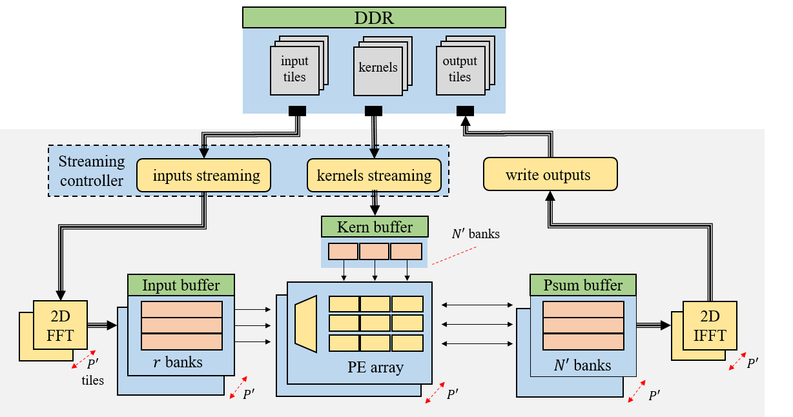

# CNN.frequencyFPGA
This is a implementation of [CNN accelerator in frequency domain](https://drive.google.com/open?id=1m6wFzUvWs9t-mcq7LSifnz4H7qcFSfiu). 

## Architecture overview
Figure below is the top view of the whole architecture. This repo is just for on-chip implementation, in which we first apply **2D FFT** to the input image tiles, then **Hadamard** product is applied to both frequency-domain input tiles and kernels. After all input channels on current tiles are done, we use **2D IFFT** to convert the result back into spatial domain.

## Synthesis result
- FPGA: Xilinx Alveo U200
- CAD tool: Vivado 2018.3
- Data format: 16-bit Fixed-point

| LUT  | DSP | BRAM | Freq|
|---|---|---|---|
|230K|2860/6840|1469/2160|200MHz|
|||||

## Dir
```
./
|
|--src: core design source code.
|
|--sim: simulation testbench and data.
    |
    |--testbench: testbench code
    |
    |--data: test data
```

